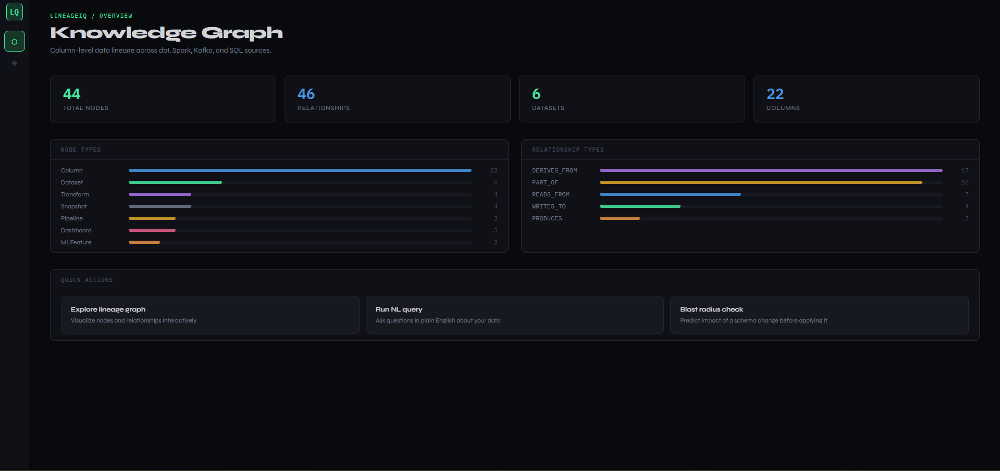
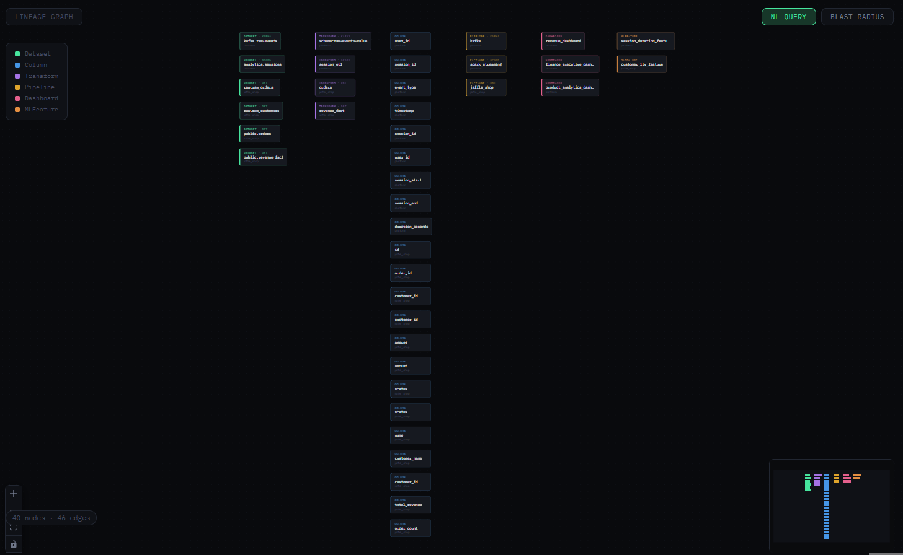
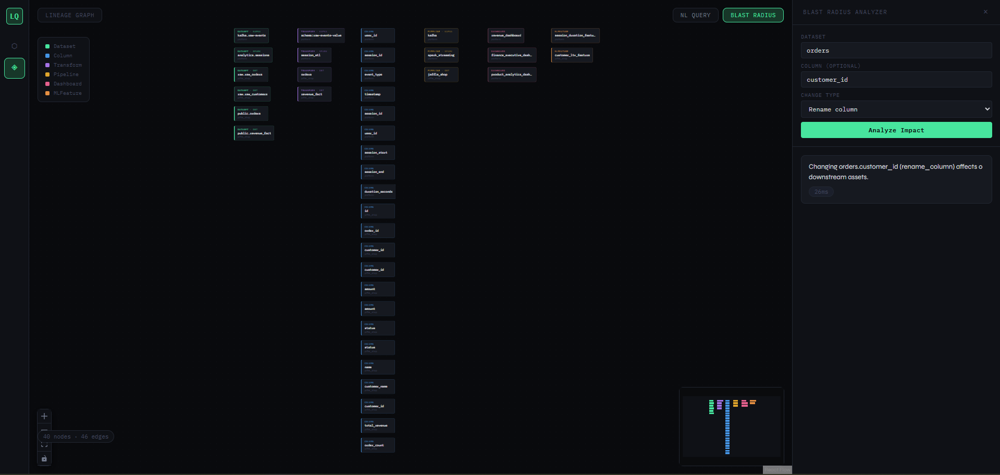

<div align="center">

<br/>

```
██╗     ██╗███╗   ██╗███████╗ █████╗  ██████╗ ███████╗    ██╗ ██████╗
██║     ██║████╗  ██║██╔════╝██╔══██╗██╔════╝ ██╔════╝    ██║██╔═══██╗
██║     ██║██╔██╗ ██║█████╗  ███████║██║  ███╗█████╗      ██║██║   ██║
██║     ██║██║╚██╗██║██╔══╝  ██╔══██║██║   ██║██╔══╝      ██║██║▄▄ ██║
███████╗██║██║ ╚████║███████╗██║  ██║╚██████╔╝███████╗    ██║╚██████╔╝
╚══════╝╚═╝╚═╝  ╚═══╝╚══════╝╚═╝  ╚═╝ ╚═════╝ ╚══════╝    ╚═╝ ╚══▀▀═╝
```

### Column-Level Data Lineage & Schema Impact Analysis Engine

*Graph-native lineage · Blast radius estimation · Natural language queries · Real-time ingestion*

<br/>

[](https://github.com/Sanskar121543/lineageiq/actions)
[](https://python.org)
[](https://fastapi.tiangolo.com)
[](https://neo4j.com)
[](https://reactjs.org)
[](https://kafka.apache.org)
[](https://docker.com)
[](LICENSE)

<br/>

> **Schema changes break pipelines. Usually, nobody knows until it's too late.**
> LineageIQ shows you exactly what will break — before you make the change.

<br/>

</div>

---

## Benchmarks

> Measured locally with Grafana k6 under concurrent Docker load. Zero failed requests across all runs.

### Blast Radius Endpoint — Stress Test

| Metric | Result |
|--------|--------|
| Concurrent Users | **50** |
| Total Requests | **20,881** |
| Throughput | **1,389 req/sec** |
| Avg Latency | **35.79 ms** |
| P95 Latency | **44.65 ms** |
| Error Rate | **0%** ✅ |

### Mixed API — Load Test

| Metric | Result |
|--------|--------|
| Concurrent Users | **20** |
| Total Requests | **3,810** |
| Throughput | **188.90 req/sec** |
| Avg Latency | **105.34 ms** |
| P95 Latency | **271.06 ms** |
| Error Rate | **0%** ✅ |

---

## The Problem

Modern data stacks are sprawling. A single column flows through dbt models, Spark transforms, Kafka topics, downstream dashboards, and ML feature pipelines. When an engineer renames or drops that column, failures surface in production — hours or days later, in systems they didn't know depended on it.

The root cause is always the same: **nobody had a map.**

LineageIQ builds the map — at column level, across every system, automatically — and answers the question that matters before any schema change ships:

> *"If I change this column, what breaks?"*

---

## Product Preview

### Overview Dashboard


### Interactive Lineage Graph


### Blast Radius Analyzer


---

## Architecture

```
┌──────────────────────────────────────────────────────────────────────┐
│                          DATA SOURCES                                │
│                                                                      │
│   dbt manifests  ·  Spark execution plans  ·  SQL query logs         │
│   Kafka schema registry  ·  Dashboard metadata                       │
└─────────────────────────────┬────────────────────────────────────────┘
                              │
                              ▼
┌──────────────────────────────────────────────────────────────────────┐
│                    INGESTION & PARSING LAYER                         │
│                                                                      │
│   sqlglot SQL parser  ·  dbt manifest reader  ·  Celery workers      │
│   Kafka consumers  ·  Async FastAPI ingest endpoints                 │
└─────────────────────────────┬────────────────────────────────────────┘
                              │
                              ▼
┌──────────────────────────────────────────────────────────────────────┐
│                     NEO4J KNOWLEDGE GRAPH                            │
│                                                                      │
│   Nodes: Dataset · Column · Transform · Dashboard · ML Feature       │
│   Edges: DERIVES_FROM · READS · WRITES · FEEDS · DEPENDS_ON         │
│                                                                      │
│   Column-level granularity across the entire data stack              │
└────────────┬────────────────┬───────────────────────┬───────────────┘
             │                │                       │
             ▼                ▼                       ▼
     ┌──────────────┐  ┌────────────────┐  ┌──────────────────┐
     │ Blast Radius │  │   NL Query     │  │  Lineage Graph   │
     │   Analyzer   │  │   Engine       │  │    Explorer      │
     │              │  │                │  │                  │
     │ Upstream /   │  │ Plain English  │  │ React Flow UI    │
     │ downstream   │  │ → Cypher →     │  │ Interactive DAG  │
     │ impact rank  │  │ Graph results  │  │ visualization    │
     └──────┬───────┘  └──────┬─────────┘  └────────┬─────────┘
             │                │                       │
             └────────────────┴───────────────────────┘
                                      │
                                      ▼
┌──────────────────────────────────────────────────────────────────────┐
│              FASTAPI BACKEND  ·  REDIS CACHE  ·  POSTGRESQL          │
└──────────────────────────────────────────────────────────────────────┘
```

---

## Core Features

### Column-Level Lineage

Most lineage tools track tables. LineageIQ tracks columns — the individual fields that actually break when schemas change.

A column's full journey through the stack is visible in one graph: where it originates, which transforms touch it, which dashboards read it, and which ML features depend on it.

### Blast Radius Analysis

Before renaming a column, dropping a field, or changing a type — run blast radius.

LineageIQ traverses the graph downstream from the changed column, collects every affected asset, and ranks them by criticality. The result isn't a warning. It's a prioritized impact report.

```
Input:  column rename  →  orders.customer_id
Output: 4 dbt models · 2 dashboards · 1 ML feature · 3 Kafka consumers
        Ranked by: criticality · freshness · owner team
```

### Natural Language Queries

The graph is queryable in plain English. LineageIQ translates questions into Cypher and returns structured results.

```
"Which dashboards depend on the orders table?"
"What upstream sources feed the revenue_monthly model?"
"Show me everything downstream of kafka.events.checkout"
```

### Real-Time Ingestion

New dbt runs, schema changes, and Kafka topic updates flow into the graph automatically. Lineage stays current without manual maintenance.

---

## Tech Stack

| Layer | Technology |
|-------|-----------|
| **Backend** | FastAPI · Python 3.11 · Pydantic |
| **Graph Database** | Neo4j 5.x |
| **SQL Parsing** | sqlglot |
| **Cache** | Redis |
| **Task Queue** | Celery |
| **Streaming** | Apache Kafka |
| **Relational** | PostgreSQL |
| **Frontend** | React 18 · TypeScript · React Flow |
| **Monitoring** | Prometheus · Flower |
| **Infra** | Docker · Docker Compose |

---

## Quick Start

**Prerequisites:** Docker Desktop · Docker Compose v2 · OpenAI API key · 8 GB RAM

```bash
# 1. Clone
git clone https://github.com/Sanskar121543/lineageiq.git
cd lineageiq

# 2. Configure
cp .env.example .env        # Linux / macOS
# Copy-Item .env.example .env   # Windows PowerShell
# Add your OPENAI_API_KEY and other values

# 3. Start full stack
docker compose up -d --build

# 4. Seed sample data
docker compose exec backend python scripts/seed_fixtures.py
```

| Service | URL |
|---------|-----|
| React UI | http://localhost:3000 |
| FastAPI Docs | http://localhost:8000/docs |
| Neo4j Browser | http://localhost:7474 |
| Flower (workers) | http://localhost:5555 |

---

## API Reference

| Method | Endpoint | Description |
|--------|----------|-------------|
| `GET` | `/api/v1/stats` | Graph-wide statistics |
| `GET` | `/api/v1/lineage/graph` | Full lineage graph |
| `GET` | `/api/v1/lineage/datasets` | All registered datasets |
| `POST` | `/api/v1/lineage/ingest/dbt` | Ingest dbt manifest |
| `POST` | `/api/v1/impact/blast-radius` | Compute impact of a schema change |
| `POST` | `/api/v1/query/nl` | Natural language graph query |
| `GET` | `/api/v1/query/suggestions` | Query autocomplete suggestions |

---

## Useful Commands

```bash
# Stack management
docker compose up -d --build
docker compose down
docker compose ps

# Logs
docker compose logs -f backend
docker compose logs -f frontend

# Database
docker compose exec backend python scripts/seed_fixtures.py
docker compose exec neo4j cypher-shell -u neo4j -p lineageiq_dev

# Tests
docker compose exec backend pytest

# Dev mode (hot reload)
docker compose -f docker-compose.dev.yml up --build
```

---

## Project Structure

```
lineageiq/
├── backend/
│   ├── api/            # FastAPI route handlers
│   ├── graph/          # Neo4j query layer
│   ├── ingestion/      # dbt, Spark, Kafka parsers
│   ├── impact/         # Blast radius engine
│   ├── workers/        # Celery task definitions
│   └── scripts/        # Seed and utility scripts
├── frontend/
│   ├── src/
│   │   ├── components/ # React Flow graph, panels
│   │   └── pages/      # Dashboard, lineage, impact views
├── infra/              # Production deployment configs
├── docs/
├── docker-compose.yml
├── docker-compose.dev.yml
├── Makefile
└── .env.example
```

---

## Roadmap

- [ ] dbt Cloud webhook integration
- [ ] Airflow DAG lineage ingestion
- [ ] Column-level PII classification
- [ ] Slack alerts on blast radius threshold breach
- [ ] Kubernetes deployment
- [ ] Multi-tenant workspace support

---

<div align="center">

**Data pipelines break silently. Lineage makes the invisible visible.**

*Know your blast radius before it becomes an incident.*

<br/>

[](https://github.com/Sanskar121543/lineageiq)

</div>
